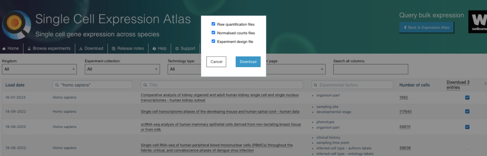

## **Are you familiar with Jupyter Notebooks?**

Jupyter Notebooks are an interactive tool that combines executable code, explanatory text, visualizations, and other elements into a single document. Widely used in data science, machine learning, and computational analysis, they support multiple programming languages, with Python being the most popular. Their intuitive interface simplifies data exploration, experiments, and real-time documentation.
Here, we have text cells and code cells serve distinct purposes for organizing and presenting content within notebooks:

**Text Cells**
* These are used for adding explanations, descriptions, and formatting using Markdown or HTML. 
* You can insert headings, lists, links, equations, and other elements to document your work and make it more comprehensible (for you and other people who want to use them). 

Add a Text Cell:
1. Click the + Text button in the top toolbar.
2. Enter your text in the cell using Markdown for formatting (e.g., # for headings, ** for bold text, * for italics).
3. Click outside the cell or press Shift + Enter to render the formatted text.

## Jupyter Cells

**Code Cells** 
* These are used to write and execute programming code, primarily in Python.
* They allow you to test algorithms, manipulate data, and create visualizations, with outputs displayed directly below the executed code.

Add a Code Cell:
1. click the + Code button at the top toolbar of the notebook to insert a code cell below the active one.
2. Enter your code in the cell and press *Shift + Enter* to execute it.

```python
# Teste de código Python
test = 4
print(test)
```

Here I can *write* **beautiful** texts

## **Notes:**

**1:** If you want to see the webpages/videos inside this notebook, you need to add this extension:

[Google extension](https://chrome.google.com/webstore/detail/ignore-x-frame-headers/gleekbfjekiniecknbkamfmkohkpodhe) or [Firefox Extension](https://addons.mozilla.org/en-US/firefox/addon/ignore-x-frame-options-header/)

**2:** If you want to create a Colab notebook with an R kernel, you can do it with this link:

[Colab with R](https://colab.to/r) or

[Other form](https://colab.research.google.com/notebook#create=true&language=r)

# **Google Colaboratory**

Google Colab is a free cloud-based platform that allows you to create, run, and share Jupyter notebooks directly in your browser. It supports languages like Python and provides access to powerful computational resources such as GPUs and TPUs, making it ideal for machine learning and data science tasks. 

Additionally, it integrates with Google Drive, enabling easy storage and real-time collaboration.

```html
<iframe width="1000" height="606" src="https://www.youtube.com/embed/inN8seMm7UI" frameborder="0" allow="accelerometer; autoplay; clipboard-write; encrypted-media; gyroscope; picture-in-picture; web-share; fullscreen"></iframe>
```


# **Exploring Single-Cell RNA-seq repositories**

In this activity, we will explore online repositories and tools for single-cell RNA-seq data analysis. We will navigate through various databases, including the Single Cell Expression Atlas (https://www.ebi.ac.uk/gxa/sc/home), Human Cell Atlas Data Portal (https://data.humancellatlas.org/), CELLXGENE (https://cellxgene.cziscience.com/), SRA (https://www.ncbi.nlm.nih.gov/sra), GEO (https://www.ncbi.nlm.nih.gov/geo/), (https://panglaodb.se/), CellType (https://celltype.info/), and CellTypist (https://www.celltypist.org/), to discover and explore single-cell RNA-seq datasets. Through this hands-on exercise, you will learn how to access, visualize, and interpret single-cell RNA-seq data using online resources.

*Objectives:*

- Explore single-cell RNA-seq data repositories and tools
- Learn how to access and visualize single-cell RNA-seq data
- Understand how to interpret single-cell RNA-seq data

*Note:* This activity is designed to be completed in a self-paced manner, and you can work through the exercises at your own speed.

## Single Cell Expression Atlas

The Single Cell Expression Atlas is a public resource for exploring single-cell RNA-seq data across various tissues, cell types, and biological conditions. It provides interactive visualizations and gene expression maps to study cellular heterogeneity and gene activity at a single-cell level.

*Practical Exercises:*

1. *Explore the Single Cell Expression Atlas General Interface*:

    - Go to the Single Cell Expression Atlas website. You can access the website through your own browser or the browser embedded in the end of this session in this notebook: https://www.ebi.ac.uk/gxa/sc/home

    - One of the advantages of this repository is the wide range of organisms with single-cell data available, covering Animals, Plants, Fungi and Protists species. Navigate through the webpage, exploring the different species available and explore the one of your interest to furher explore.

    - Explore also the other set of experiments available, which includes data from the Human Cell Atlas, Fly Cell Atlas, Malaria Cell Atlas, COVID-19 Data Portal and discovAIR initiatives.


2. *Search for a Dataset of Interest*:
    - By selecting an species or excperiment collection of interest, you will have access to a list of experiments linked to that organism/initiative.

    - There you can select experiments based on different variables, including the organism Kingdom, Experiment Collection, Technology Type. You can also explore other features such as the Title of the study, Experimental Factors (e.g. organism parte, developmental state, age, etc), and the Number of Cells available.
    
    - There you can also select the set of experiments of interest to download the Raw quantification files, Normalised counts files and Experiment design file.




3. *Visualize and Explore Available Data*:
    - Select a gene or cell type of interest and navigate through the interactive browser, exploring different aspects of the data available.

    - Select datasets based on the "Inferred cell type - ontology labels" or "Organism part".

    - Select a dataset of interest and dive into all the data available.
    - Visualize the gene expression profiles using the interactive plots (e.g., t-SNE, heatmap).
    
    - Visualize gene markers and enjoy other nice features from the repository.


4. *Now enjoy the reposity, by playing with the data and genes of interest. You can use the embedded browser available below, or the main browser from your computer.*

```html
<iframe width="1150" height="700" src="https://www.ebi.ac.uk/gxa/sc/home"></iframe>
```
